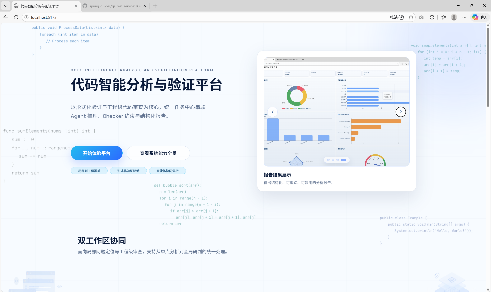
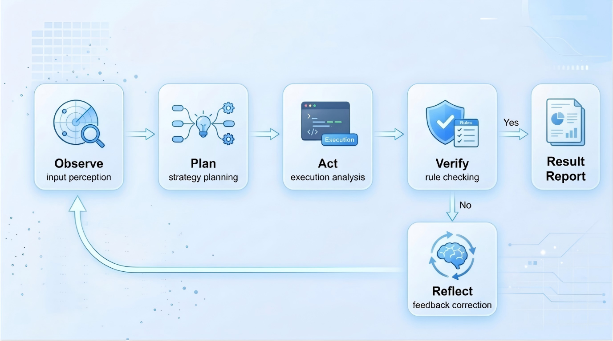

# 代码智能分析与验证平台

## 项目简介
本项目是一个面向代码分析与验证流程的一体化工程平台，聚焦“局部代码分析 + 工程代码审查 + Agent 协同分析 + 结构化报告输出”四条主线能力。平台通过统一工作台承接代码片段、文件与仓库级输入，在同一任务链路中完成分析配置、过程追踪、结果归档与报告复用。前端提供可交互的分析页面、项目树浏览、阶段日志、统计图表与报告中心；后端负责任务编排、代码扫描、模型调用、Checker 约束校验与结果聚合。系统强调工程可追踪性与结果可解释性，支持从分析过程到结论证据的全链路落地，能够输出风险等级、问题类型、目录热点、文件级定位与修复建议等结构化信息。该平台适用于课程实验、团队评审、工程质量巡检与风险定位等场景，目标不是替代开发流程，而是提供一个稳定、可扩展、可持续迭代的代码智能分析基础设施。🚀

## 平台首页展示 🖥️


首页展示了双工作区入口、分析链路与场景化能力说明。

## Agent 工作流图 🤖


工作流体现了 Observe-Plan-Act-Verify-Reflect 的协同分析闭环。

## 核心功能概述
- 局部代码分析：面向函数或片段进行逻辑理解、风险提示与验证反馈。
- 工程代码审查：面向仓库级代码结构进行问题定位、风险分层与修复建议输出。
- Agent 协同分析：通过多阶段推理与规则校验提升分析过程的可解释性与稳定性。
- 结构化报告输出：沉淀任务状态、问题明细、统计图表与可追踪审查结论。📊

## 项目结构
```text
code-intel-analysis-platform/
├─ backend/                     # 后端服务：任务编排、接口、校验与数据聚合
├─ frontend/                    # 前端工作台：交互页面、图表展示、状态管理
├─ backend/scripts/             # 环境初始化与数据库相关脚本
├─ frontend/src/assets/media/   # 首页与报告模块使用的图片/视频资源
└─ README.md                    # 项目说明文档
```

## 快速开始 ⚙️
### 1) 初始化
```powershell
//初始化

$env:SQLSERVER_ADMIN_USER="sa"
$env:SQLSERVER_ADMIN_PASSWORD="123456"
.\backend\scripts\init-sqlserver.ps1 -Server localhost -Port 1433
```

### 2) SQL 环境变量
```powershell
//SQL

$env:NUTERA_SQLSERVER_URL="jdbc:sqlserver://localhost:1433;databaseName=code_intel_analysis;encrypt=false;trustServerCertificate=true"
$env:NUTERA_SQLSERVER_USERNAME="test"
$env:NUTERA_SQLSERVER_PASSWORD="123456"
$env:NUTERA_REPORT_DB_STARTUP_CHECK_STRICT="true"
```

### 3) 启动后端
```powershell
//backfront

.\mvnw -f backend/pom.xml spring-boot:run
```

### 4) 启动前端
```powershell
//frontend

npm run dev
```

## 技术栈
- 前端：Vue、Vite、Element Plus、ECharts、GSAP
- 后端：Java、Spring Boot、Maven
- 数据与任务：SQL Server（环境变量配置）、任务轮询与日志聚合机制

## 说明
项目将持续围绕“可验证、可追踪、可复用”的代码分析流程演进，欢迎基于实际使用场景提出改进建议。✨
